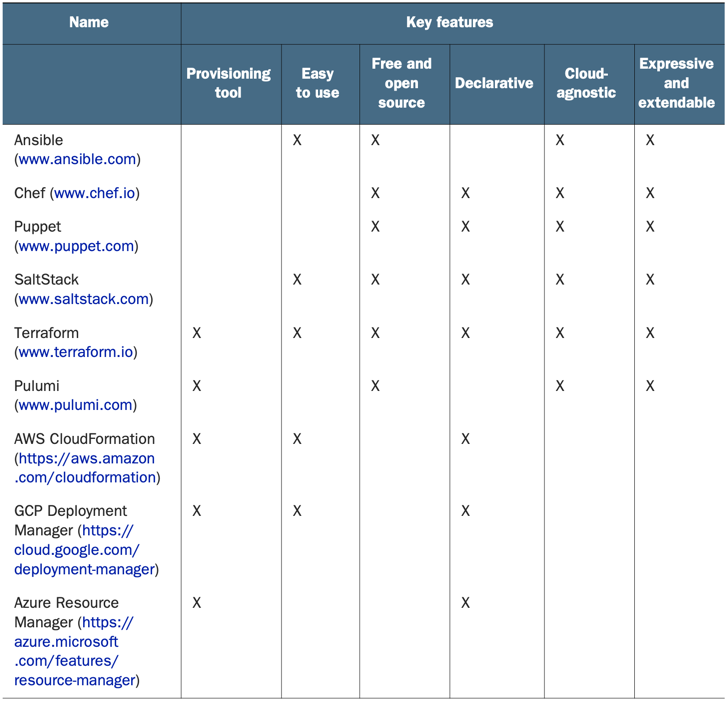

## A comparison of popular IaC tools

### Pulumi Vs Terraform
Pulumi is technologically the most similar to Terraform, the only difference being that it’s not declarative. The Pulumi team considers this an advantage over Terraform, but Terraform also has a cloud development kit (CDK) that allows you to do the same thing.

### Provisioning tool
Terraform is an infrastructure provisioning tool, not a CM tool.
Provisioning tools deploy and manage infrastructure, whereas CM tools like Ansible, Puppet, SaltStack, and Chef deploy software onto existing servers.
CM tools favor mutable infrastructure.
Provisioning tools favor immutable infrastructure.

### Free and open source software
The engine that powers Terraform is called Terraform core, a free and open source soft- ware offered under the Mozilla Public License v2.0.
There’s no premium version of Terraform, but business and enterprise solutions are available for running Terraform at scale: Terraform Cloud and Terraform Enterprise.

### Declarative programming
Express the logic of a computation (the what) without describing the control flow (the how).

### Cloud-agnostic
Cloud-agnostic means being able to seamlessly run on any cloud platform using the same set of tools and workflows.

### Diff.
| Terraform | AWS CloudFormation |
|---|---|
|support For loops|for loops not supported|
|Wait conditions not supported|Support wait conditions|

### Writing the Terraform configuration
<b>resource:</b> Terraform resources are the most important elements in Terraform, as they provision infrastructure such as VMs, load balancers, NAT gateways, and so forth.

**resource** has inputs and outputs. 
**Inputs are called arguments**, and 
**outputs are called attributes**.

**Providers** don’t have outputs—only inputs. You configure a provider by passing inputs, or configuration arguments, to the provider block.

The **terraform show** command can be used to print human-readable output from the state file and makes it easy to list information about the resources that Terraform manages.
Terraform has a special command to destroy all resources: **terraform destroy**.

**data** sources code block are called query constraint arguments. Data sources are unmanaged resources that Terraform can read data from but that Terraform doesn’t directly control.

