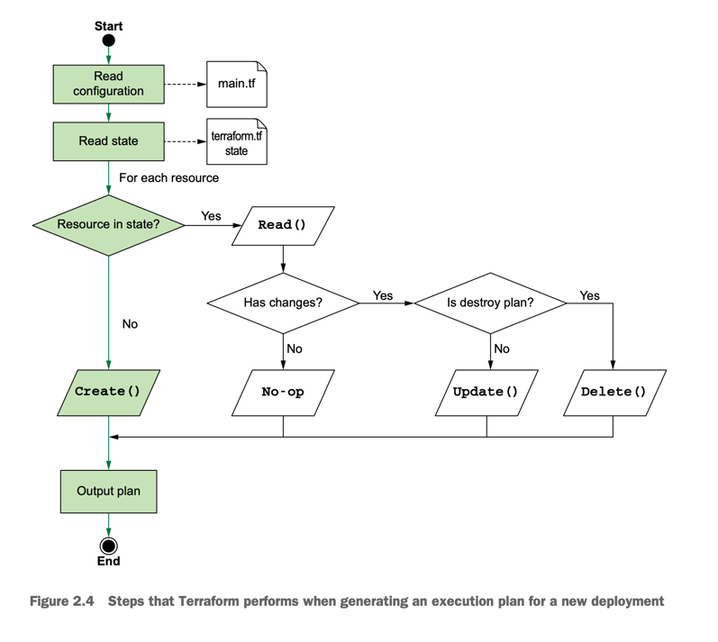
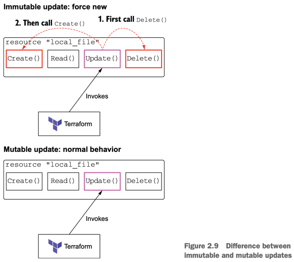

Terraform is a state management tool that performs CRUD operations (create, read, update, delete) on managed resources. 
Anything that can be represented as CRUD can be managed as a Terraform resource.


**_local-only resources_** and exist within the confines of Terraform or the machine running Terraform.
**Local-only** resources typically serve marginal purposes, such as to glue “real” infrastructure together, but they also make a great teaching aid. 
Examples of local-only resources include resources for creating private keys, self-signed TLS certificates, and random ids.


## Process overview
All Terraform resources implement the resource schema interface. 
The resource schema mandates, among other things, that resources define CRUD functions hooks, one each for Create(), Read(), Update(), and Delete(). 

<<- sequence indicates an indented heredoc string. Anything between the opening identifier and the closing identifier (EOT) is interpreted literally.
Leading whitespace, however, is ignored (unlike traditional heredoc syntax).


**terraform {...}**, special configuration block responsible for configuring Terraform. Its primary use is version-locking your code, but it can also configure where your state file is stored and where providers are downloaded.

`You may have to initialize again if you add new providers or modules.`

Terraform has created a lock file **.terraform.lock.hcl** to record the provider selections.
Include this file in your version control repository so that Terraform can guarantee to make the same selections by default when you run "terraform init" in the future.

`you can turn on trace-level logging by setting the environment variable TF_LOG =trace to a non-zero value, e.g. export TF_LOG=trace.`

Although this particular **terraform plan** should have exited quickly, some plans take a while to complete.
It all has to do with how many resources you are deploying and how many resources you already have in your state file.

If **terraform plan** is running slowly, turn off trace-level logging and consider increasing parallelism (_-parallelism=n_).



Terraform has a special command for visualizing the dependency graph: **terraform graph**. This command outputs a dotfile that can be converted to a digraph using a variety of tools.

## Performing No-Op
```
 terraform plan
 
 local_file.literature: Refreshing state... [id=262612c6b5e2169d098751e409cfbd26d6715ba2]
 No changes. Your infrastructure matches the configuration.
 
 Terraform has compared your real infrastructure against your configuration and found no differences, so no changes are needed.
```
There are no changes, as we would expect. When a Read() returns no changes, the resulting action is a no-operation (no-op).

## Updating the local file resource


### Detecting configuration drift
If there are ad hoc changes to the file through means outside of Terraform? 
Configuration drift is a common occurrence in situations where multiple privileged users are on the same file system.

How does Terraform deal with configuration drift? 
By calculating the difference between the current state and the desired state and performing an update.

### Terraform refresh
How can we fix configuration drift?

Terraform automatically fixes it if you run **terraform apply**, but let’s not do that right away. For now, let’s have Terraform reconcile the state that it knows about with what is currently deployed. This can be done with **terraform refresh**.

You can think of terraform refresh like a terraform plan that also alters the state file. It’s a read-only operation that does not modify managed existing infrastructure—just Terraform state.

