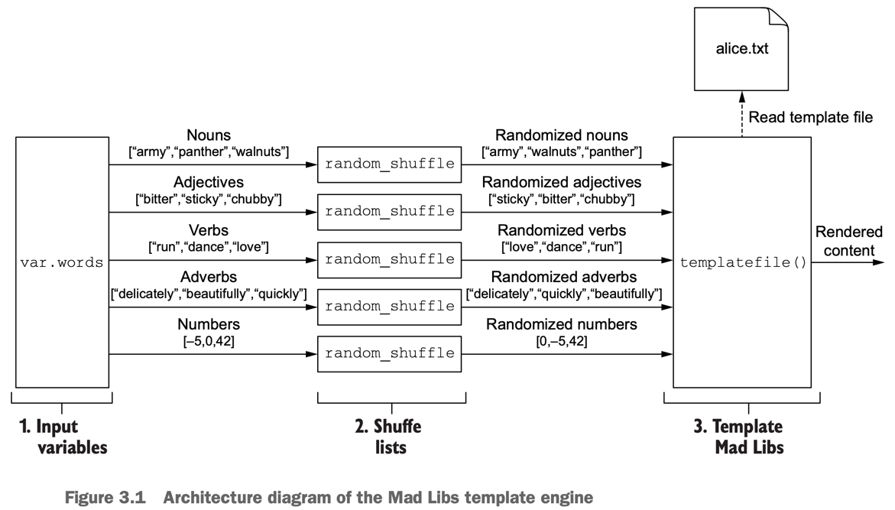
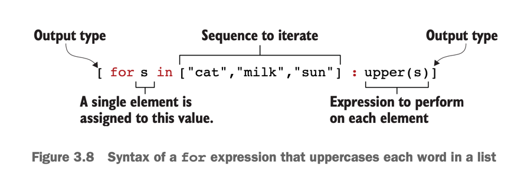

**_Functional programming_** is a declarative programming paradigm that allows you to do many things in a single line of code.

The core principles of functional programming are as follows:
- **Pure functions** — Functions return the same value for the same arguments, never having any side effects.
- **First-class and higher-order functions—Functions** are treated like any other variables and can be saved, passed around, and used to create higher-order functions.
- **Immutability** — Data is never directly modified. Instead, new data structures are created each time data would change.

### Generates Mad Libs paragraphs from template files.

```
To make a pizza, you need to take a lump of <noun> and make a thin, round, <adjective> <noun>.

To make a pizza, you need to take a lump of roses and make a thin, round, colorful jewelry.
```



## Input variables
Variable blocks accept four input arguments:
```
default — A preselected option to use when no alternative is available. Leaving this argument blank means a variable is mandatory and must be explicitly set.
description — A string value providing helpful documentation to the user.
type — A type constraint to set for the variable. Types can be either primitive (e.g. string, integer, bool) or complex (e.g. list, set, map, object, tuple).
validation — A nested block that can enforce custom validation rules.
```

## Templates
Create an alice.txt template file.
Template syntax is the same as for interpolation values in the main Terraform language, which is anything enclosed in ${ ... } markers.

### Generating many Mad Libs stories
- template/alice.txt

### for expressions



The general logic is as follows:
- Loop through each key-value pair in var.words.
- Uppercase each word in the value list.
- Save the result to a local value.

Looping through each key-value pair in var.words and outputting a new map can be done with the following expression:
```{for k,v in var.words : k => v }```

The next expression uppercases each word in a list and outputs to a new list:
```[for s in v : upper(s)]```

By combining these two expressions, we get
`{for k,v in var.words : k => [for s in v : upper(s)]}`

Optionally, if you want to filter out a particular key, you can do so with the if clause. For example, to skip any key that matches "numbers", you could do so with the fol- lowing expression:
`{for k,v in var.words : k => [for s in v : upper(s)] if k != "numbers"}`

### Zipping files
```
data "archive_file" "mad_libs" {
    depends_on  = [local_file.mad_libs]
    type        = "zip"
    source_dir  = "${path.module}/madlibs"
    output_path = "${path.cwd}/madlibs.zip"
}
```

## Expression reference

|Name|Description|Example|
|----|-----------|-------|
|Conditional expression|Uses the value of a boolean expression to select one of two values|condition ? true_value : false_value|
|Function call|Transforms and combines values|<FUNCTION NAME>(<ARG 1>, <ARG2>)|
|for expression|Transforms one complex type to another|[for s in var.list : upper(s)]|
|Splat expression|Shorthand for some com- mon use cases that could otherwise be handled by for expressions|var.list[*].id Following is the equivalent for expression: [for s in var.list : s.id]|
|Dynamic block|Constructs repeatable nested blocks within resources|```dynamic "ingress" {for_each = var.service_ports content {from_port = ingress.value to_port = ingress.value protocol = "tcp"} }```|
|String template interpolation|Embeds expressions in a string literal|"Hello, ${var.name}!"|
|String template directives|Uses conditional results and iterates over a collection within a string literal|%{ for ip in var.list.*.ip } server ${ip} %{ endfor }|