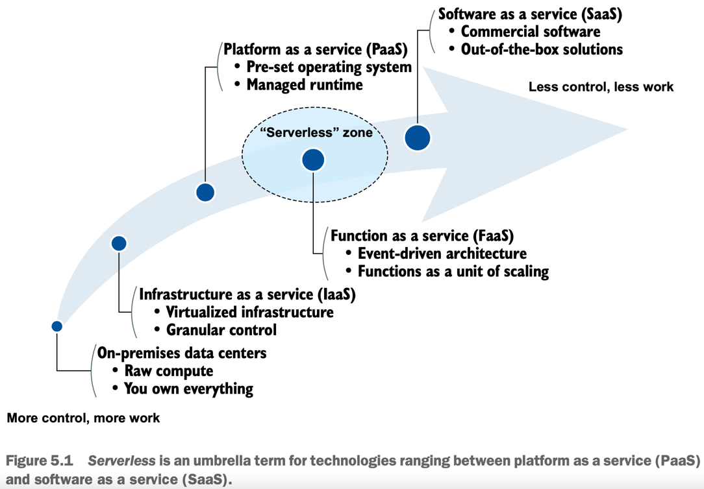

## Serverless is not a single technology; it’s a suite of related technologies sharing two key characteristics:
### Pay-as-you-go billing
- Pay-as-you-go billing is about paying for the actual quantity of resources consumed rather than pre-purchased units of capacity (i.e. pay for what you use, not what you don’t use).
### Minimal operational overhead
- Minimal operational overhead means the cloud provider takes on most or all responsibility for scaling, maintaining, and managing the service.



Let’s assume, for the sake of argument, that you were using ARM templates (or CloudFormation, if you are on AWS). 
_How do you migrate your old systems into Terraform without investing considerable time up front?_ 
**By using the strangler façade pattern.**

The strangler façade pattern is a pattern for migrating a legacy system to a new system by slowly replacing the legacy parts with new parts until the new system completely supersedes the old system. 
At that point, the old system may be safely decommissioned. 
It’s called the strangler façade pattern because the new system is said to “strangle” the legacy system until it dies off. 


## Generating configuration code
The most painful thing about Terraform is that it takes a lot of work to translate what you want into configuration code. 
It’s usually much easier to point and click around the console until you have what you want and then export that as a template.

```
A number of open source projects aim to address this problem, most notably Terraformer: https://github.com/GoogleCloudPlatform/terraformer. 
HashiCorp also promises that it will improve imports to natively support generating configuration code from deployed resources in a future release of Terraform.
```

