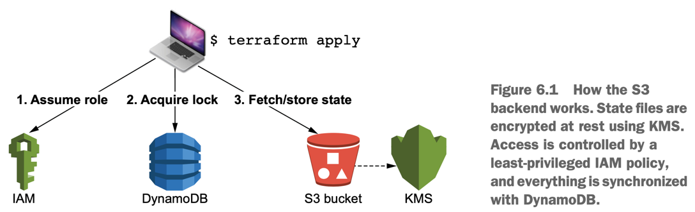

A _race condition_ is an undesirable event that occurs when two entities attempt to access or modify shared resources in a given system. 
In Terraform, race conditions occur when two people are trying to access the same state file at the same time, such as when one is performing 
a _terraform apply_ and another is performing _terraform destroy_. 
If this happens, your state file can become out of sync with what’s actually deployed, resulting in what is known as a corrupted state. 
**Using a remote backend end with a state lock prevents this from happening.**


We introduce HashiCorp’s proprietary products for teams and organizations: **Terraform Cloud and Terraform Enterprise**.

## Standard and enhanced backends

Backends can do the following tasks:
- Synchronize access to state files via locking 
- Store sensitive information securely
- Keep a history of all state file revisions
- Override CLI operations

**Standard Backends**  
- The main responsibility of any backend is to determine how state files are stored and accessed. 
- For remote backends, this generally means some kind of encryption at rest and state file versioning.
- The most popular standard backend is the S3 remote backend for AWS (probably because most people use AWS).

**Enhanced backends**
- allow you to do more sophisticated things like run CLI operations on a remote machine and stream the results back to your local terminal.
- also allow you to read variables and environment variables stored remotely, so there’s no need for a variables definition file (terraform.tfvars).
- they currently only work for **Terraform Cloud and Terraform Enterprise**.



Four distinct components are required to deploy an S3 backend:
- DynamoDB table — For state locking.
- S3 bucket and Key Management Service (KMS) key — For state storage and encryption at rest.
- Identity and Access Management (IAM) least-privileged role — So other AWS accounts can assume a role to this account and perform deployments against the S3 backend.
- Miscellaneous housekeeping resources — We’ll talk more about these later.

## different design pattern for organizing code
**_Flat modules_** (as opposed to nested modules) organize your codebase as lots of little .tf files within a single monolithic module.
Each file in the module contains all the code for deploying an individual component, which would otherwise be broken out into its own module.

**advantage**
- The primary advantage of flat modules over nested modules is a reduced need for boilerplate, as you don’t have to plumb any of the modules together. 
- For example, instead of creating a module for deploying IAM resources, the code could be put into a file named iam.tf.

## Sharing modules
### GitHub
- create a repo with a name in the form terraform-<PROVIDER>-<NAME>, eg. terraform-aws-s3backend
- A sample configuration for sourcing a module from a GitHub repo is as follows:

```
module "s3backend" {
  source ="github.com/terraform-in-action/terraform-aws-s3backend"
}
```  
### Terraform Registry
- Terraform Registry is free and easy to use; all you need is a GitHub account to get started (https://registry.terraform.io).
- The Terraform Registry always reads from public GitHub repos, publishing your module in the registry makes your module available to everyone.
- Its main benefit is that it enforces certain naming conventions and standards based on established best practices for publishing modules.
- the perks of Terraform Enterprise is that it lets you have your own private Terraform Registry, which is useful for sharing private modules in large organizations.
- Here’s a list of the official rules:
  - Be a public repo on GitHub.
  - Have a name in the form terraform-<PROVIDER>-<NAME>.
  - Have a README.md file (preferably with some example usage code).
  - Follow the standard module structure (i.e. have main.tf, variables.tf, and outputs.tf files).
  - Use semantic versioned tags for releases (e.g. v0.1.0).

### S3 backend
- Deploying one backend per team is a reasonable way to go about partitioning things because you don’t want all your state files in one bucket, but you still want to give people enough autonomy to do their job.
- If you are highly disciplined about least-privileged IAM roles, it’s fine to have a single backend. That’s how Terraform Cloud and Terraform Enterprise work, after all.

#### Storing state in the S3 backend
```
terraform {
  backend "s3" {
   bucket = "team-rocket-1qh28hgo0g1c-state-bucket"
   key = "jesse/james"
   region = "us-west-2"
   role_arn = "arn:aws:iam::215974853022:role/team-rocket-1qh28hgo0g1c-tf-assume-role"
   dynamodb_table = "team-rocket-1qh28hgo0g1c-state-lock"
  }
  required_version = ">= 0.15"
  required_providers {
    null = {
      source  = "hashicorp/null"
      version = "~> 3.0"
      } 
  }
}
```

## Reusing configuration code with workspaces
- Each workspace can use its own variable definitions file to parameterize the environment.
- Whenever you perform **terraform init**, Terraform creates and switches to a workspace named **default**. 
- You can prove this by running the command **terraform workspace list**.
- To create and switch to a new workspace other than the default, use the command **terraform workspace select <workspace>**.
- You could have saved your state files under different names, such as dev.tfstate and prod.tfstate, and pointed to them with a com- mand like **terraform apply -state=<path>**.
- You use workspaces because remote state backends support workspaces and not the **-state** argument.

### Deploying multiple environments
- terraform init
- dev deploy
  - immediately switching to a more appropriately named workspace. `terraform workspace new dev`
  - `terraform apply -var-file=./environments/dev.tfvars -auto-approve`
  - The state file has now been created in the S3 bucket under the key env:/dev/{key attribute from provider}.
- prod deploy
  - `terraform workspace new prod`
  - `terraform state list`
  - `terraform apply -var-file=./environments/prod.tfvars -auto-approve`

## Introducing Terraform Cloud
- The free tier does a lot for you by giving you a free remote state store and enabling VCS/API driven workflows.
- Team management, single sign-on (SSO), and Sentinel “policy as code” are the bonus features you get when you pay for the higher-tiered offerings.
