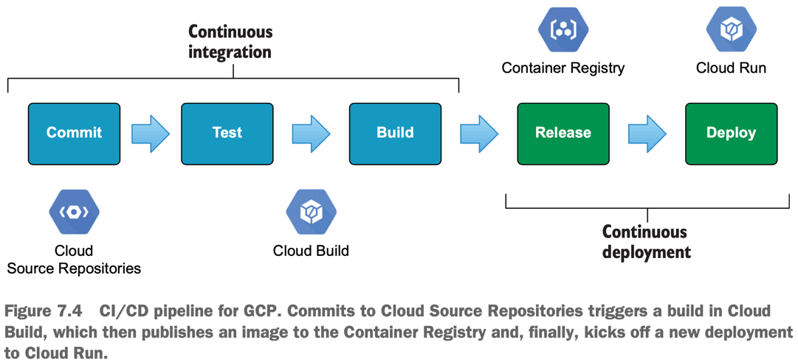

## Blueprint



### The dark road of resource provisioners
- Resource provisioners should be used only as a method of last resort.
- Some of the worst Terraform bugs I have ever encountered have resulted from an overreliance on resource provisioners. 
- You can’t destroy, you can’t apply, you’re just stuck—and it feels terrible. 
- HashiCorp has publicly stated that resource provisioners are an anti-pattern, and they may even be deprecated in a newer version of Terraform. 
- Some of the lesser-used provisioners have already been deprecated as of Terraform 0.13.

## Dyanmic Blocks
- Having the build steps declared statically doesn’t help if you didn’t know what those steps were at deployment time. Also, this approach is not configurable. 
- To solve this annoying problem, HashiCorp introduced a new expression called _dynamic blocks_.
- Dynamic blocks were designed to solve the niche problem of how to create nested configuration blocks dynamically in Terraform. 
- Dynamic blocks can only be used within other blocks and only when the use of repeatable configuration blocks is supported.
- Dynamic blocks are situationally useful, such as when creating rules in a security group or steps in a Cloud Build trigger.
- Dynamic nested blocks can be combined with local values or input variables

## Authentication
### Running Terraform Outside of Google Cloud
- If you are running Terraform outside of Google Cloud, generate an external credential configuration file (example for OIDC based federation) or a service account key file and set the **GOOGLE_APPLICATION_CREDENTIALS** environment variable to the path of the JSON file.
### Using Terraform Cloud
- Create an environment variable called **GOOGLE_CREDENTIALS** in your Terraform Cloud workspace.
- Remove the newline characters from your JSON key file and then paste the credentials into the environment variable value field.
- Mark the variable as Sensitive and click Save variable.


## Setup Networking
```
https://medium.com/google-cloud/cloud-run-and-load-balancing-go-beyond-your-own-project-adfa1c8b001d
```