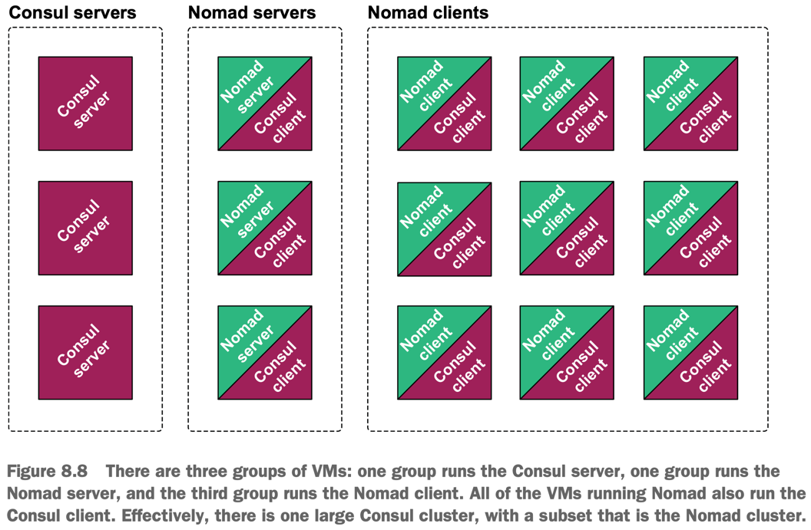
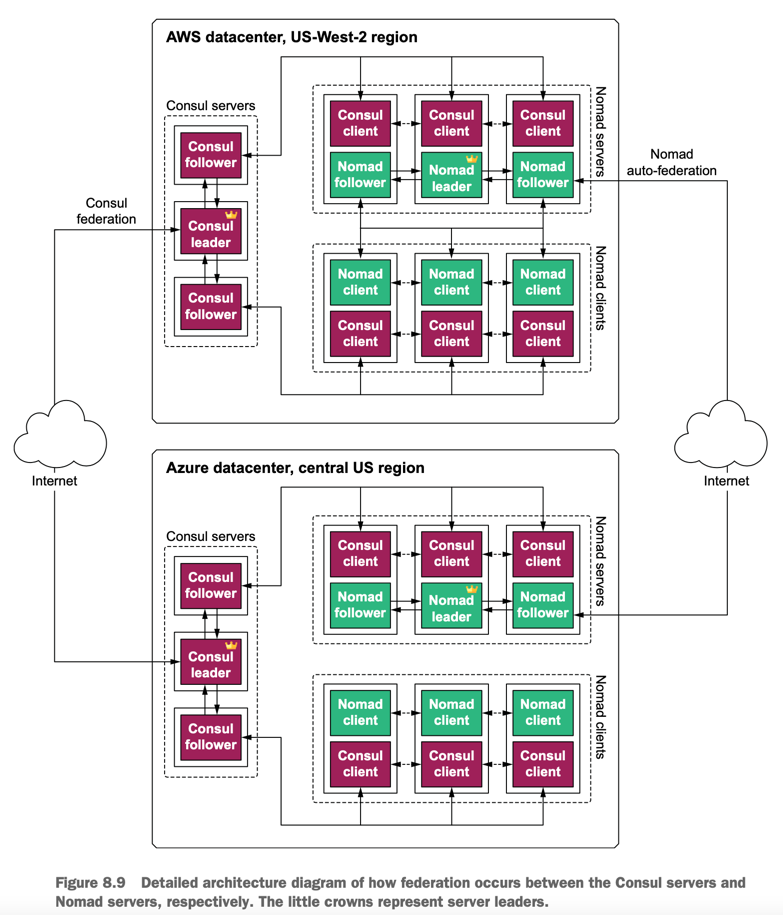
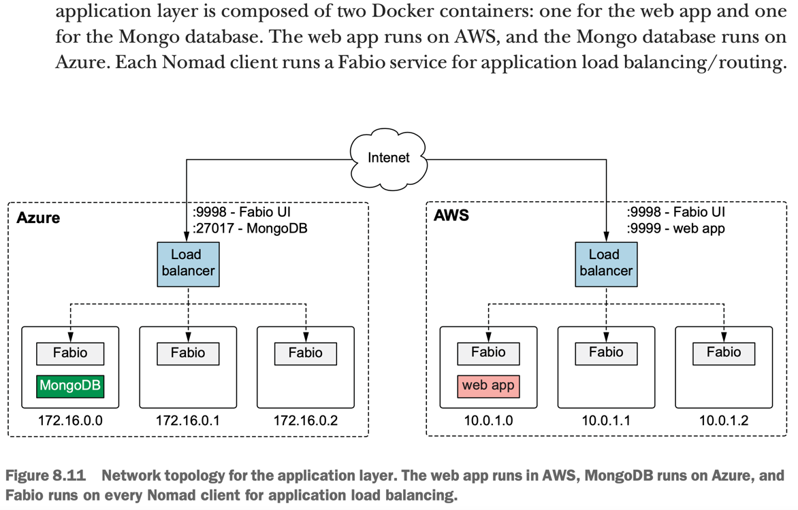

**Multi-cloud** refers to any heterogeneous architecture that employs multiple cloud vendors.
- For example, you may have a Terraform project that deploys resources onto both AWS and GCP; that would be multi-cloud.

**Hybrid cloud** is a mix of private and public cloud vendors.

It’s fair to say that most companies, even those that are mature in the cloud, would never adopt a multi-cloud strategy if they were not forced to do so by external factors, such as mergers and acquisitions. 
For example, if a large enterprise company uses AWS and acquires a smaller startup that uses GCP, the enterprise suddenly has a multi-cloud architecture whether it intended to or not.

## Advantages of Multi-cloud vs Mono-cloud
- Flexibility—You can choose the best-in-class services from any cloud.
- Cost savings—Pricing models vary between cloud vendors, so you can save money by choosing the lower-price option.
- Avoiding vendor lock-in—It’s generally not a good idea to lock yourself into a particular vendor because doing so puts you in a weak negotiating position.
- Resilience—Multi-cloud architectures can be designed to automatically fail over from one cloud to the other, making them more resilient than single-cloud architectures.
- Compliance—Internal or external factors may play a role. For example, if you want to operate out of China, you are forced to use AliCloud to comply with government regulations.

## Hybrid-cloud load balancing
- It’s a hybrid-cloud load balancer, meaning it will be deployed locally as a Docker container but will load-balance machines residing in AWS, GCP, and Azure. 
- Load balancing is performed with round-robin DNS, so each time the page is refreshed, it takes you to the next machine in the list.

