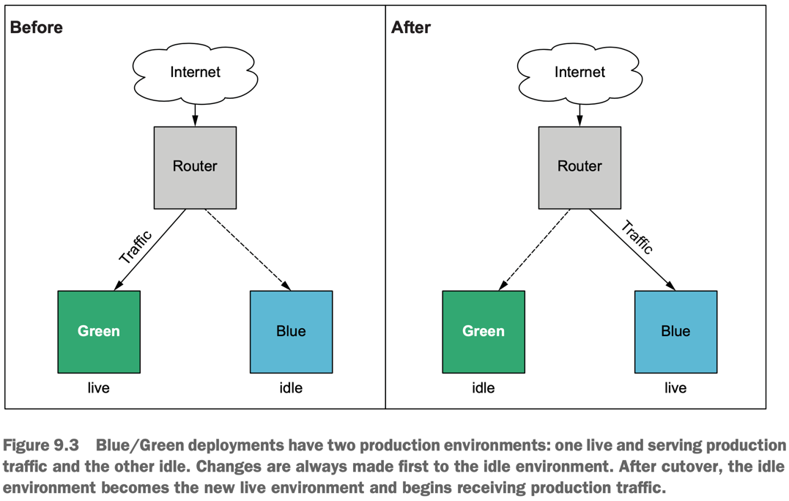
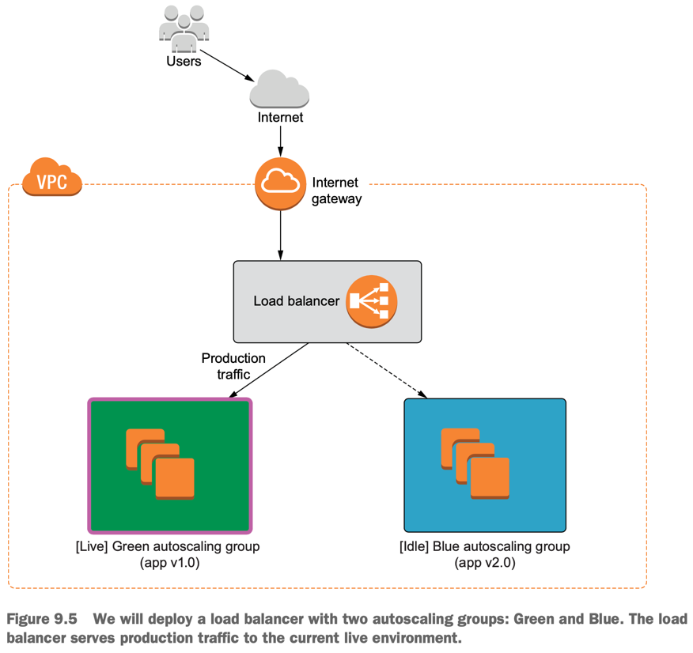

**Zero-downtime deployment (ZDD)** is the practice of keeping services always running and available to customers, even during software updates. 
If a **ZDD** is executed well, users should not be aware when changes are being made to the system.

## 3 Approaches of ZDD
- **First** 
  - we use the **create_before_destroy** meta attribute to ensure that an application is running and passing health checks before we tear down the old instance.
  - When it’s set to true, interesting and unexpected behavior can result.
- **Second**
  - Blue/ Green deployments. 
  - This technique uses two separate environments (one “Blue” and the other “Green”) to rapidly cut over from one software version to another.
  - Blue/Green is a stepping stone toward more advanced forms of ZDD, such as rolling Blue/Green and canary deployments.
- **Third**
  - Ansible is a popular configuration management tool that allows you to rapidly deploy applications onto existing infrastructure.
  - By provisioning all your static infrastructure with Terraform, Ansible can be used to deploy the more dynamic applications.

## Lifecycle customizations
- The lifecycle nested block is present on all resources. You can set the following three flags:
  - **create_before_destroy (bool)** — When set to true, the replacement object is created before the old object is destroyed.
    `create_before_destroy doesn’t default to true because many providers do not allow two instances of the same resource to exist simultaneously. For example, you can’t have two S3 buckets with the same name.` 
 
```
 resource "aws_instance" "instance" {
  ami           = var.ami
  instance_type = "t3.micro"
  lifecycle {
    create_before_destroy = true
  }
  user_data = <<-EOF
    #!/bin/bash
    mkdir -p /var/www && cd /var/www
    echo "App v${var.version}" >> index.html
    python3 -m http.server 80
  EOF 
  
  provisioner "local-exec" {
    command = "./health-check.sh ${self.public_ip}"
  }
}
 ```

  - **prevent_destroy (bool)** — When set to true, Terraform will reject any plan that would destroy the infrastructure object associated with the resource with an explicit error.
  - **ignore_changes (list of attribute names)** — Specifies a list of resource attributes that Terraform should ignore when generating execution plans. This allows a resource to have some measure of configuration drift without forcing updates to occur.

## Blue/Green deployments
- Whenever you want to deploy to production, you first deploy to the idle environment. 
- Then, when you are ready, you switch the router from pointing to the live server to pointing to the idle server—which is already running the latest version of the software. 
- This switch is referred to as a **cutover** and can be done manually or automatically.
- When the **cutover** completes, the idle server becomes the new live server, and the former live server is now the idle server.





take the following additional considerations into account before implementing Blue/Green for your deployments:
- Cost savings
  - The idle group does not need to be exactly the same as the active group. 
  - You can save money by scaling down the instance size or the number of nodes when not needed. 
  - All you have to do is scale up right before you make the **cutover**.
- Reducing the blast radius
  - Instead of having the load balancer and autoscaling groups all in the same Terraform workspace, it may be better to have three workspaces: one for Blue, one for Green, and one for the base.
  - When performing the manual **cutover**, you mitigate risk by not having all your infrastructure in the same workspace.
- Canary deployments
  - With AWS Route 53, you can perform canary deployments by having two load balancers and routing a percentage of the production traffic to each. 
  - Note that this may require executing a series of incremental Terraform deployments.

## Configuration management
- Configuration management (CM) enables rapid software delivery onto existing servers.
- First, we know that Terraform is not as immutable as it claims to be: in-place updates and **local-exec provisioners** are examples to the contrary.
- Second, CM is not as mutable as you might be led to believe.

```
resource "aws_instance" "ansible_server" {
    ami = data.aws_ami.ubuntu.id instance_type = "t3.micro"
    vpc_security_group_ids = [aws_security_group.allow_ssh.id] 
    key_name = aws_key_pair.key_pair.key_name
    
    tags = {
      Name = "Ansible Server"
    }
    
    provisioner "remote-exec" {
      inline = [
        "sudo apt update -y",
        "sudo apt install -y software-properties-common",
        "sudo apt-add-repository --yes --update ppa:ansible/ansible", 
        "sudo apt install -y ansible"
      ]
        
      connection {
        type        = "ssh"
        user        = "ubuntu"
        host        = self.public_ip
        private_key = tls_private_key.key.private_key_pem
      }
    }
    
    provisioner "local-exec" {
        command = "ansible-playbook -u ubuntu --key-file ansible-key.pem -T 300 -i '${self.public_ip},', app.yml"
    } 

}

output "public_ip" {
   value = aws_instance.ansible_server.public_ip
}

output "ansible_command" {
  value = "ansible-playbook -u ubuntu --key-file ansible-key.pem -T 300  -i '${aws_instance.ansible_server.public_ip},', app.yml"
}
```