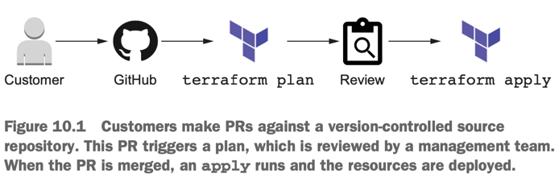
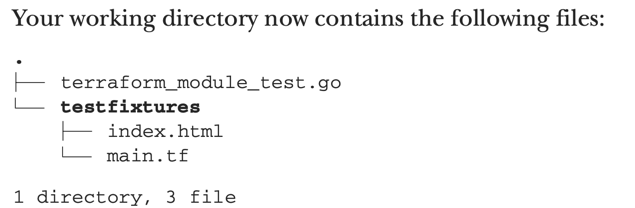

Benefits of refactoring include the following:
- Maintainability: The ability to quickly fix bugs and address problems faced by customers.
- Extensibility: How easy it is to add new features. If your software is extensible, then you are more agile and able to respond to marketplace changes.
- Reusability: The ability to remove duplicated and highly coupled code. Reus- able code is readable and easier to maintain.

There are (at least) three levels of software testing to consider:
- ~~unit tests~~: From a Terraform perspective, we typically do not worry about unit tests because they are already implemented at the provider level.
- integration tests: for a given set of inputs, does a subsystem of Terraform (i.e., a module) deploy without errors and produce the expected output?  
- ~~system tests~~: We also don’t care much about developing system tests because they are not as well defined when it comes to infrastructure as code (IaC).

### Module Expansions (For handle code maintainability)
- Module expansions are a Terraform 0.13 feature allowing the use of **count** and **for_each** on modules.

## Test Terraform code
- terraform-exec (https://github.com/hashicorp/terraform-exec) : HashiCorp golang library that makes it possible to programmatically execute Terraform commands.
- Terratest (https://terratest.gruntwork.io) : lets us write integration tests for Terraform modules.


## Self-service infrastructure provisioning



## Tainting and rotating access keys
- We can target the destruction and re-creation of individual resources (individual _aws_iam_access_key_) with the **terraform taint** command. 
- During the next apply, the resource will be destroyed and created anew. We use the command as follows: `terraform taint [options] address`
- address is the resource address that uniquely identifies a resource within a given configuration.
- address can be obtained by using command `terraform state list`.

## Testing infrastructure as code
- Static analysis, which basically makes sure configuration code is valid and has no obvious errors.
- Static analysis is done with either a linter, such as **terraform-lint** (https://github.com/terraform-linters/tflint), or a validation tool, such as **terraform validate**.

## Writing a basic Terraform test
- as a tool developed by HashiCorp, **terraform-exec** has feature parity with Terraform, whereas Terratest does not. You can run all Terraform CLI commands with terraform- exec using any combination of flags, while Terratest only allows a small subset of the most common commands.
- terraform-exec has a sister library, **terraform-json**, that lets you parse Terraform state as regular golang structures. This makes it easy to read anything you want from the state file.



```
1. go mod init
2. export AWS_ACCESS_KEY_ID=<your AWS access key>
3. export AWS_SECRET_ACCESS_KEY=<your AWS secret access key>
4. go test -v
```