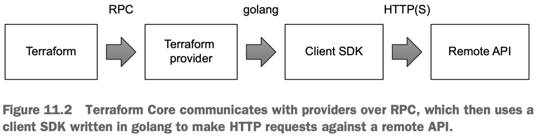

### Two excellent reasons to write a provider are
- To wrap a remote API so you can manage your infrastructure as code
- To expose utility functions to Terraform

## Develop a Petstore provider by wrapping a remote Petstore API.
- Our Petstore provider allows us to manage pets as code by exposing a **petstore_pet** resource that can create, read, update, and delete pets.

`docker run -e SWAGGER_HOST=http://localhost -e SWAGGER_URL=http://localhost:8080 -e SWAGGER_BASE_PATH=/v2 -p 8080:8080 swaggerapi/petstore`

## Resources
- Resources, as you already know, come in two flavors: **managed** and **unmanaged**.
- **Managed resources**  
  - regular resources that implement create, read, update, delete (CRUD) methods for lifecycle management.
- **Unmanaged resources**
  - data sources or read-only resources, are less complex and implement only the _Read_ part of CRUD.

## Shared configuration objects
- configuration objects that are shared between resource entities, usually for optimization or authentication purposes.
- These can be things like client and database connections, mutexes (concurrency locks), and temporary access keys.

## Prerequisites for creating your own provider that wraps a remote API
- **Existing remote API**
  - Terraform makes calls against a remote API, there must be an existing remote API to make calls to. 
  - This can be your own API or someone else’s.
- **Golang client SDK for the API**
  - Providers are written in golang, so you should have a golang client SDK for your API in place before proceeding. 
  - This will save you from having to make ugly, raw HTTP requests against the API.

